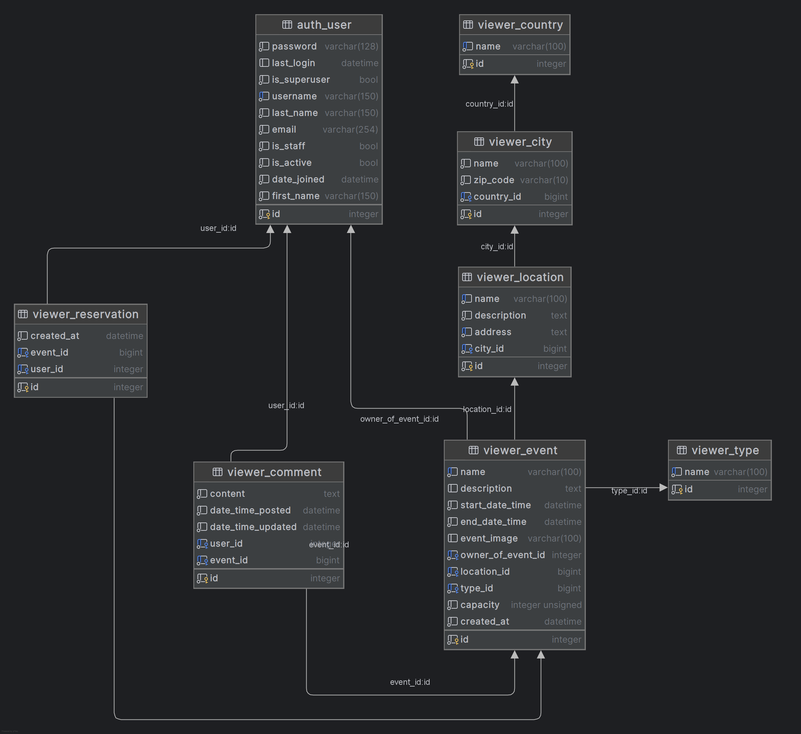
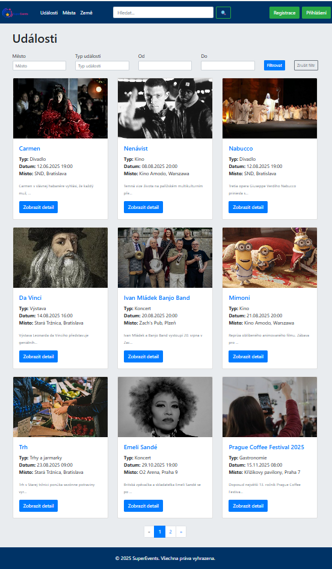
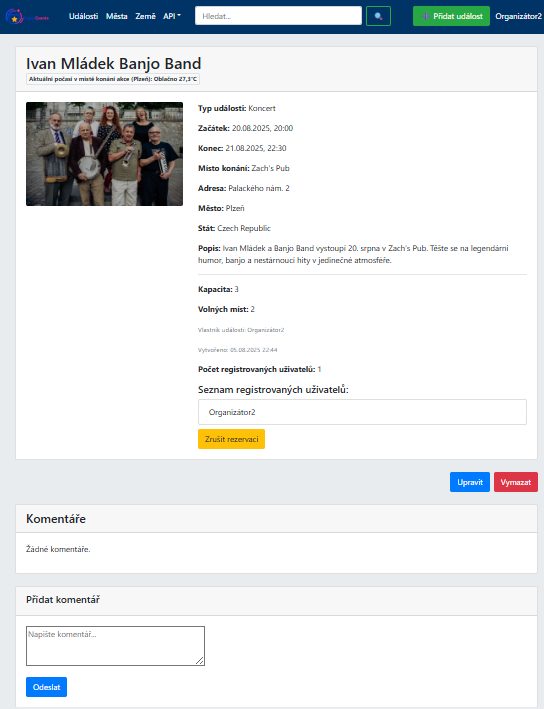
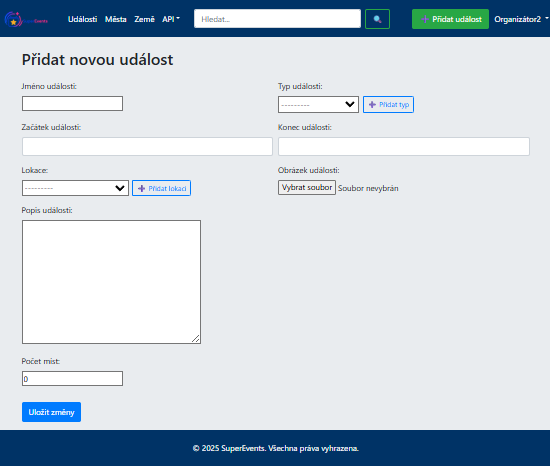
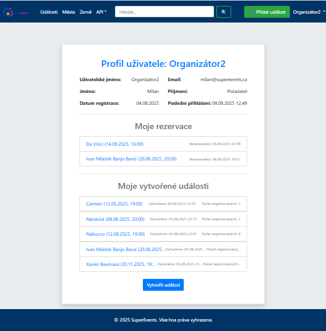
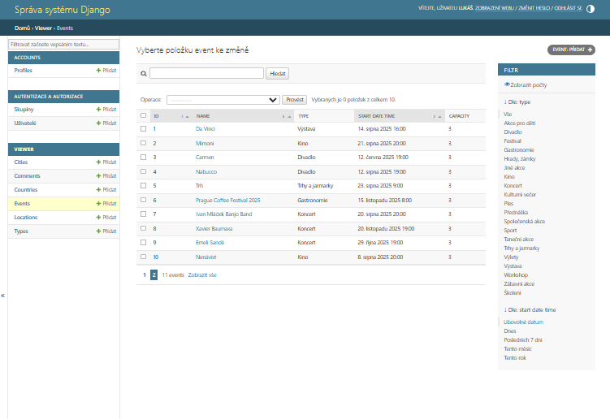

# 🗓️ SuperEvents

Projekt SuperEvents je webová aplikace sloužící k přehledné správě, organizaci
a prezentaci událostí. Uživatelé si mohou události zobrazovat, přihlašovat se na
ně, komentovat je a v případě organizátorů, je také vytvářet a spravovat.


### 👥 Tým
- [AFitzpatrik](https://github.com/AFitzpatrik)
- [Nunu8888](https://github.com/Nunu8888)  
- [OndZii](https://github.com/OndZii)  


---

## ✨ Funkce aplikace

### 👤 Uživatelské účty
- Registrace a ověření nových uživatelů
- Možnost přidání speciálních rolí (např. organizátor, admin, staff...)
- Obnova zapomenutého hesla a změna stávajícího hesla
- Uživatelský panel:
  - Zobrazení svých osobních údajů
  - Seznam organizovaných a rezervovaných událostí

### 📅 Události
- Přidávání, mazání a úprava událostí
- Přehledný seznam událostí a zobrazení podrobností v detailu události
- Oprávnění podle role (kdo může co spravovat)
- Možnost registrace na konkrétní událost
- Zobrazení obsazenosti události
- Komentáře:
  - Možnost přidávání komentářů pro přihlášené uživatele
  - Zobrazení komentářů pro nepřihlášené uživatele

### 🔍 Ostatní funkce
- Vyhledávání událostí podle konkrétního slova
- Filtrování událostí podle místa a času

### 🌐 API
- REST API pro zpracování dat
- REST API vrací seznam všech budoucích událostí 
- Možnost filtrování událostí podle časového období
- Zobrazení aktuálního **počasí** v místě události pomocí API
- Zobrazení základních informací o **státech** pomocí API
- 

---

## 🧾 Struktura projektu
- SuperEvents/
- │
- ├── events/               # Hlavní aplikace pro události
- │   ├── models.py         # Definice modelů Event, Location, City, Country, Type, Comment
- │   ├── views.py          # Logika zobrazení seznamu, detailu, filtrování, CRUD
- │   ├── forms.py          # Formuláře pro přidání/úpravu událostí, komentářů
- │   ├── urls.py           # Směrování událostí
- │   ├── templates/events/ # HTML šablony pro seznam, detail, formuláře
- │
- ├── accounts/             # Správa uživatelů
- │   ├── models.py         
- │   ├── views.py          # Registrace, login, logout, profil
- │   ├── forms.py          # Formuláře pro registraci, login, změnu hesla
- │   ├── urls.py
- │   ├── templates/accounts/
- │
- ├── api/                  # Django REST Framework API
- │   ├── serializers.py
- │   ├── views.py
- │   ├── urls.py
- │
- ├── static/               # CSS, JS, obrázky
- ├── templates/            
- ├── manage.py
- ├── requirements.txt
- └── README.md
 

---

## 🗺️ ER Diagram


---

## 📸 Screenshoty
### 🏠 Domovská stránka


### 📄 Detail události


### ✏️ Vytvoření události


### 👤 Uživatelský profil


### ⚙️ Admin panel


---

## 🛠️ Instalace

### Požadavky
- Python 3.13
- pip, venv
- git

1. **Naklonuj repozitář**
```bash
  git clone https://github.com/AFitzpatrik/petr_ondra_patrik_finalni_projekt
  cd petr_ondra_patrik_finalni_projekt
```

2. **Vytvoř a aktivuj virtuální prostředí**
```bash
  python -m venv venv
```

**Windows:**
```bash
  venv\Scripts\activate
```

**macOS / Linux:**
```bash
  source venv/bin/activate
```

3. **Nainstaluj potřebné knihovny**
```bash
  pip install -r requirements.txt
```

4. **Spusť a proveď migrace**
```bash
  python manage.py makemigrations
  python manage.py migrate
```

5. **Spusť vývojový server**
```bash
  python manage.py runserver
```
---
